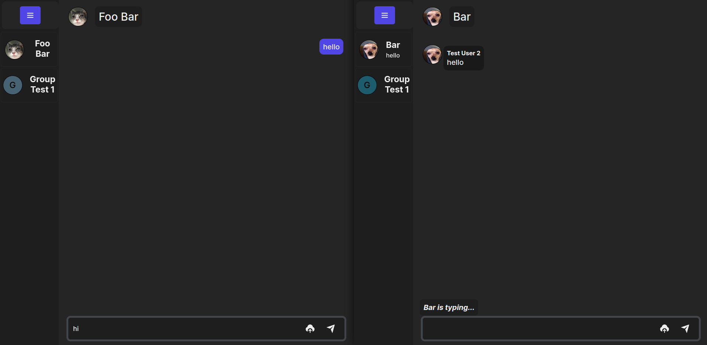

## Table of Contents:
- 1. [Introduction](#1-introduction)
- 2. [Features](#2-features)
	- [Implemented Features](#implemented-features)
	- [Unfinished Features](#unfinished-features)
- 3. [User Interface](#3-user-interface)
- 4. [Technical Implementation](#4-technical-implementation)
- 5. [Conclusion](#5-conclusion)

### 1. Introduction

- __Resendo__ is a real-time chat application, just like other chat applications which are __Telegram__, __WhatsApp__, __Messenger__, etc.
- __Resendo__ is created via my interest about making a real-time application, with the intention of learning about socket, how socket works, how to implement it, etc.

### 2. Features

##### Implemented Features
- ___Message___: Users can send and receive messages sent by other users, as well as anyone in the group. There are two types of chats: peer-to-peer chat and group chat, typing indicator is also implemented for each type.
- ___Request___: Users can send friend requests to other users, and those other users could either accept or reject the request.
- ___Group___: Users can create groups without a single member, and they can add and remove members.
- ___Profile___: Users can customize their own profiles, but this is limited.
- ___Authentication___: Easy registration and login, only need email to login.
- ___Media___: User can send media such as images, videos (limit: 10MB).

##### Unfinished Features
- ___Notification___: A real-time notification whenever the user receives a message.
- ___Chat audio___: A sound effect is played whenever the notification is appended. 

### 3. User Interface

##### Chat Layout

### 4. Technical Implementation

- In order to make this application, what I have used to accomplish it:
	- [__Vue.js__](https://vuejs.org/): An open-source front-end JavaScript framework used for building user interfaces and single-page applications.
	- [__Express.js__](https://expressjs.com/): A popular open-source web application framework for Node.js.
	- [__Socket.IO__](https://socket.io/): Esstential module, a real-time, bidirectional, event-driven framework for building scalable network applications in JavaScript.
	- [__Mongoose__](https://mongoosejs.com/): An ODM for connect and to work with MongoDB databases by defining schemas, models and managing relationships between data.
	- [__Cloudinary__](https://cloudinary.com/): A cloud-based media management solution that provides an end-to-end image and video management service, including upload, storage, administration, manipulation, optimization, and delivery.

### 5. Conclusion

- This project has finished after a month (05/03/2023 to 05/04/2023), there were a plenty of things that I had experienced:
	- The struggle from the client side: Literally the most thing I've suffered when it comes to front-end is design and making the user interface for the app. It's due to my lack of creativity and incomplete visualization. At first, the client was made in React, but the inefficiency in performance caused me to migrate to Vue, and the migration really took a lot of time to complete. The responsiveness is awful and drives me crazy.
- What I've learned:
	- Always have a blueprint before diving into making user interfaces.